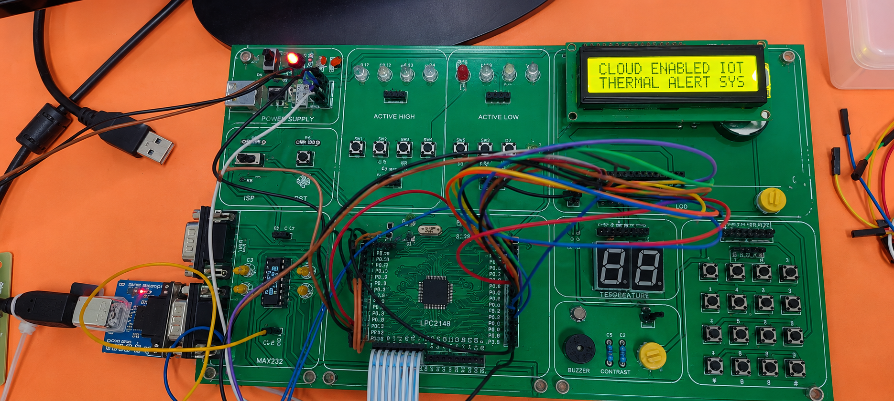
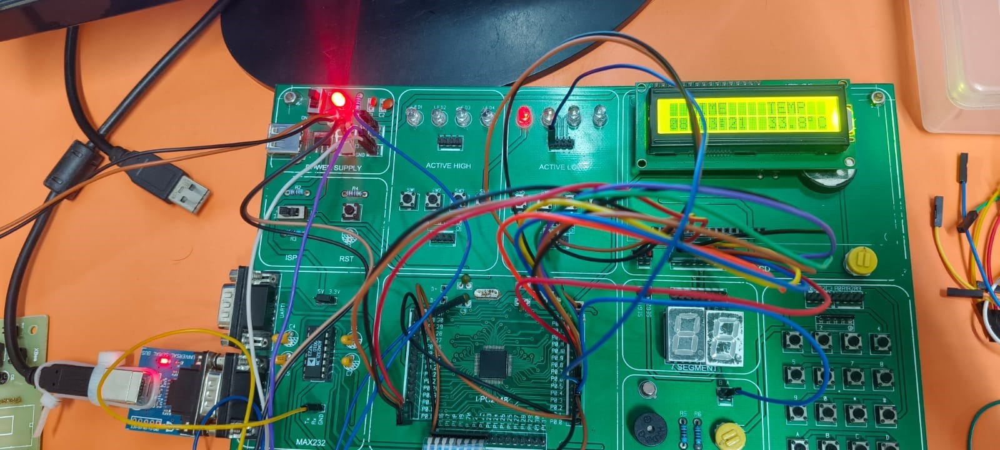
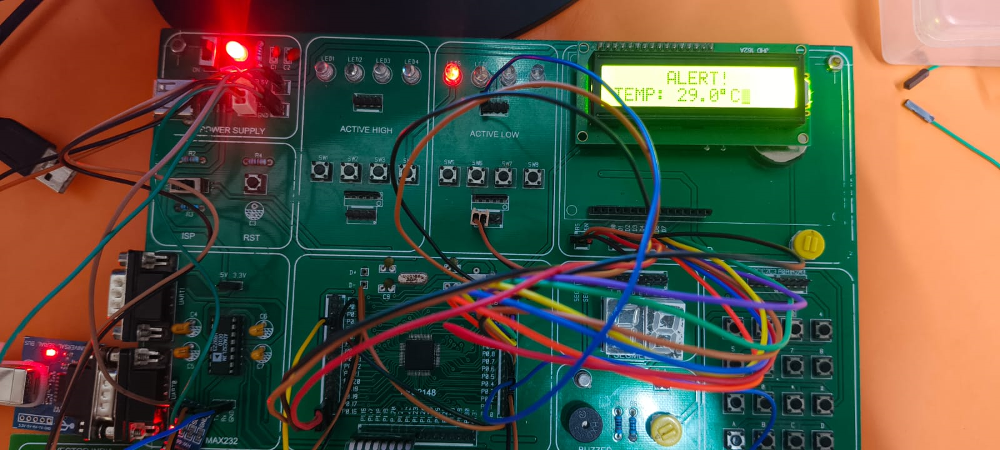
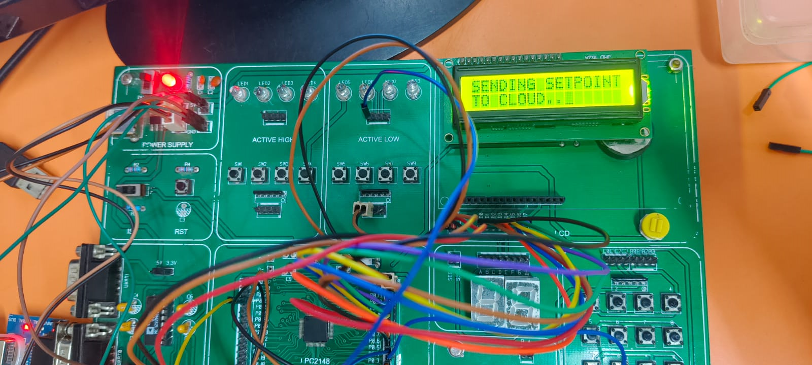
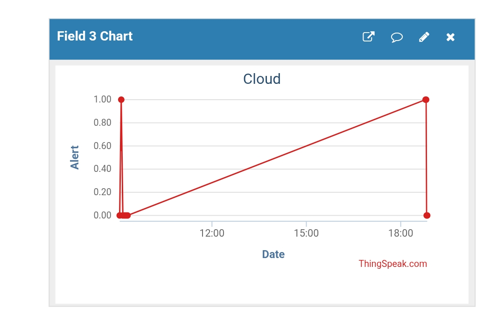
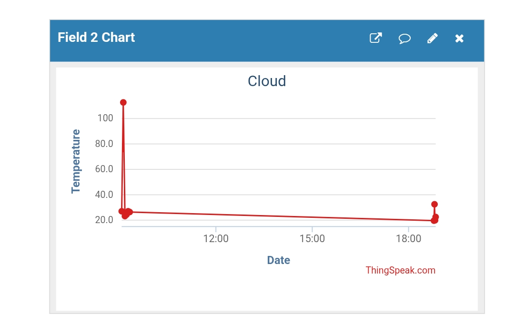
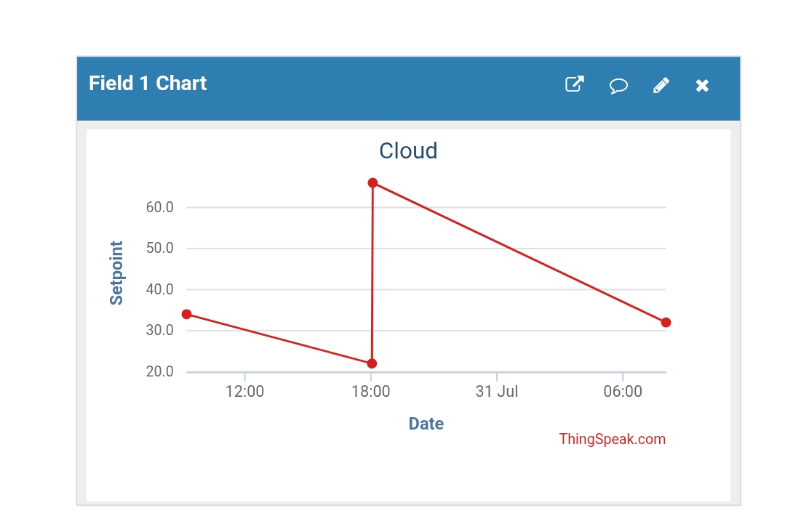

# ☁️ Cloud-Enabled IoT 🌡️ Thermal Alert & 📊 Logging System
## 📖 Project Description

The **Cloud-Enabled IoT 🌡️ Thermal Alert & 📊 Logging System** is an embedded IoT project designed to monitor temperature in real time, log sensor data to the cloud, and generate thermal alerts when the temperature exceeds a predefined threshold. Built using the **LPC2148 ARM7 Microcontroller**, **LM35 Temperature Sensor**, **ESP-01 Wi-Fi Module**, and **ThingSpeak**, the system supports both local and remote set-point configuration, enabling efficient and reliable temperature monitoring from anywhere.

## 🎯 Aim
To design and implement a cloud-enabled IoT thermal monitoring system capable of real-time temperature monitoring, cloud data logging, thermal alert generation, and remote set-point management.
## ✨ Features

- 🌡️ **Real-Time Temperature Monitoring** – Continuously measures ambient temperature using the LM35 sensor.
- ☁️ **Cloud Data Logging** – Uploads temperature readings to the ThingSpeak cloud for remote monitoring and analysis.
- 📡 **Wi-Fi Connectivity** – Uses the ESP-01 module to enable seamless IoT communication.
- 🎯 **Remote Set-Point Configuration** – Allows users to update the temperature threshold remotely through the cloud.
- ⌨️ **Local Set-Point Adjustment** – Supports on-device set-point configuration using a 4×4 matrix keypad.
- 💾 **EEPROM Data Persistence** – Stores the configured set-point in EEPROM to retain settings after power loss.
- 🚨 **Automatic Thermal Alerts** – Activates a buzzer whenever the measured temperature exceeds the configured threshold.
- 🕒 **Real-Time Clock Integration** – Displays accurate date and time using the RTC module.
- 📺 **Live LCD Display** – Shows temperature, set-point, time, and system status on a 16×2 LCD.
- ⚡ **Embedded ARM7-Based Design** – Built around the LPC2148 microcontroller for reliable real-time operation.
  

 ### 🛠️ Hardware Components

| **Component** | **Model / Module** | **Function** |
|---------------|--------------------|--------------|
| 🧠 **Microcontroller** | LPC2148 (ARM7TDMI-S) | Controls the entire system, processes sensor data, and manages all peripherals. |
| 🌡️ **Temperature Sensor** | LM35 | Measures ambient temperature and provides an analog voltage proportional to temperature. |
| 📡 **Wi-Fi Module** | ESP-01 (ESP8266) | Enables wireless communication with the ThingSpeak cloud platform. |
| 🖥️ **Display** | 16×2 LCD | Displays temperature, set-point, date, time, and system status. |
| ⌨️ **Input Device** | 4×4 Matrix Keypad | Allows users to configure the temperature set-point locally. |
| 🕒 **Real-Time Clock** | DS1307 RTC | Maintains accurate date and time for timestamping. |
| 💾 **Memory** | I²C EEPROM (24Cxx Series) | Stores the configured set-point for non-volatile data retention. |
| 🚨 **Alert Device** | Piezo Buzzer | Generates an audible alarm when the temperature exceeds the set-point. |
| 🔌 **Power Supply** | 5V Regulated DC Supply | Provides stable power to all hardware components. |

## 💻 Software Requirements

| **Software** | **Version** | **Purpose** |
|--------------|-------------|-------------|
| 💻 **Keil µVision IDE** | v5.x | Develops, compiles, and debugs the Embedded C application. |
| 🔥 **Flash Magic** | v16.x or later | Uploads the compiled firmware to the LPC2148 microcontroller. |
| ☁️ **ThingSpeak** | Web Platform | Stores and visualizes real-time temperature data in the cloud. |
| 🌐 **Git** | Latest | Version control and source code management. |
| 📂 **GitHub** | Web Platform | Hosts the project repository and documentation. |
| 📝 **Embedded C** | — | Programming language used for firmware development. |

## **🏗️ System Architecture**


The system is centered around the **LPC2148 ARM7 Microcontroller**, which acquires temperature data from the **LM35 sensor** through its built-in ADC. The processed temperature is displayed on the **16×2 LCD (8-bit mode)** and compared with the configured set-point. The **ESP-01 Wi-Fi module** enables communication with the **ThingSpeak cloud** for real-time temperature logging and remote set-point updates. Users can also configure the set-point locally using the **4×4 matrix keypad**, while the **DS1307 RTC** provides accurate date and time information. The configured set-point is stored in the **I²C EEPROM** to retain data after power loss. Whenever the measured temperature exceeds the configured threshold, the **buzzer** and **LED** are activated to provide audible and visual alerts.

## ⚙️ Working Principle

| **Module** | **Working Principle** |
|-------------|-----------------------|
| 🌡️ **LM35 Temperature Sensor** | The LM35 continuously senses the ambient temperature and produces an analog voltage that is directly proportional to the measured temperature. This analog output is forwarded to the ADC channel of the LPC2148 microcontroller for further processing. |
| 🔢 **ADC (Analog-to-Digital Converter)** | The built-in ADC of the LPC2148 converts the analog voltage received from the LM35 into a digital value. The microcontroller processes this value to calculate the corresponding temperature, which is then used for display, cloud logging, and threshold comparison. |
| 🧠 **LPC2148 ARM7 Microcontroller** | Acting as the core controller, the LPC2148 coordinates all peripherals and executes the application logic. It acquires temperature data, manages local and remote set-point updates, controls communication with external devices, compares the measured temperature with the configured threshold, and activates alerts whenever necessary. |
| 📺 **16×2 LCD (8-Bit Mode)** | The LCD provides real-time visual feedback by displaying the current temperature, configured set-point, date, time, and system status. It also displays notifications such as cloud synchronization, set-point updates, and invalid input messages, enabling easy user interaction. |
| ☁️ **ESP-01 Wi-Fi Module** | The ESP-01 establishes a Wi-Fi connection and enables communication between the LPC2148 and the ThingSpeak cloud platform through UART. It periodically uploads temperature readings and retrieves the latest remote set-point, allowing users to monitor and control the system over the Internet. |
| 📊 **ThingSpeak Cloud Platform** | ThingSpeak stores temperature readings received from the ESP-01 and provides graphical visualization for remote monitoring. It also allows users to update the temperature set-point remotely, which is periodically read by the embedded system for automatic synchronization. |
| ⌨️ **4×4 Matrix Keypad** | The keypad enables users to configure the temperature set-point locally. The entered value is validated to ensure it falls within the permissible range before being accepted and stored, preventing invalid system configurations. |
| 💾 **I²C EEPROM** | The EEPROM stores the latest valid set-point using the I²C communication protocol. During system startup, the stored value is retrieved and loaded automatically, ensuring that the configured threshold is preserved even after power interruptions. |
| 🕒 **DS1307 RTC Module** | The RTC maintains accurate date and time information independently of the microcontroller. The LPC2148 reads this information periodically and displays it on the LCD, while also using it for time-based tasks such as scheduled cloud communication. |
| 🚨 **Buzzer & LED Alert System** | The LPC2148 continuously compares the measured temperature with the configured set-point. Whenever the temperature exceeds the threshold, both the buzzer and LED are activated simultaneously to provide immediate audible and visual alerts. The alert remains active until the temperature falls below the configured limit. |
| 🔄 **Overall System Operation** | The system continuously performs temperature sensing, ADC conversion, real-time display, cloud synchronization, set-point management, EEPROM storage, and alert generation in a cyclic manner. This integrated operation ensures reliable real-time thermal monitoring, cloud-based data logging, and remote system management. |

## 🚀 Getting Started

### Prerequisites

Before running the project, ensure the following hardware and software are available:

- LPC2148 ARM7 Development Board
- LM35 Temperature Sensor
- ESP-01 (ESP8266) Wi-Fi Module
- 16×2 LCD Display (8-Bit Mode)
- 4×4 Matrix Keypad
- DS1307 RTC Module
- I²C EEPROM
- Buzzer and LED
- 5V Regulated Power Supply
- Keil µVision IDE
- Flash Magic
- ThingSpeak Account

### Installation

1. Clone this repository:
   ```bash
   git clone https://github.com/your-username/Cloud-Enabled-IoT-Thermal-Alert-Logging-System.git
   ```

2. Open the project in **Keil µVision IDE**.

3. Build the project to generate the HEX file.

4. Connect the LPC2148 development board to your computer.

5. Flash the generated HEX file using **Flash Magic**.

6. Configure the ESP-01 Wi-Fi module with your Wi-Fi credentials and ThingSpeak API keys.

7. Power on the hardware and verify the LCD displays the current temperature and system status.

8. Monitor live temperature data and update the set-point remotely through ThingSpeak.

   ## 📸 Project Gallery

<table>
  <tr>
    <td align="center">
      <br>
      <b>System Hardware Setup</b>
    </td>
    <td align="center">
      <br>
      <b>LCD Temperature Display</b>
    </td>
  </tr>
  <tr>
    <td align="center">
      <br>
      <b>Alert and LED glow</b>
    </td>
    <td align="center">
      <br>
      <b>Send Set Point to cloud</b>
    </td>
  </tr>
</table>

## 📊 Output

The implemented system continuously monitors the ambient temperature using the LM35 sensor and displays the real-time temperature along with the current time on the LCD. The measured temperature is periodically uploaded to the ThingSpeak cloud platform through the ESP-01 Wi-Fi module for remote monitoring and data logging.

Users can remotely update the temperature set-point through the ThingSpeak channel. The LPC2148 controller retrieves the updated set-point, stores it in EEPROM, and immediately uses it for thermal alert generation. When the measured temperature exceeds the configured set-point, the system activates the buzzer to notify the user.

### Output Highlights
- Real-time temperature displayed on the LCD.
- Temperature data uploaded to the ThingSpeak cloud.
- Live graphical visualization of temperature on ThingSpeak.
- Remote set-point update through the cloud.
- Automatic EEPROM storage of the updated set-point.
- Buzzer activation when the temperature exceeds the set-point.

  ## 📊 Output

<table>
  <tr>
    <td align="center">
      <br>
      <b>ThingSpeak Channel Status</b>
    </td>
    <td align="center">
      <br>
      <b>Alert or Normal Graph</b>
    </td>
  </tr>
  <tr>
    <td align="center">
      <br>
      <b>Temperature Data Graph</b>
    </td>
    <td align="center">
      <br>
      <b>Remote Set-Point Update</b>
    </td>
  </tr>
</table>

## 🔮 Future Enhancements

The system can be further improved with the following enhancements:

- 📱 Develop a mobile application for remote monitoring.
- 🔔 Send SMS or email alerts when the temperature exceeds the set-point.
- 🌡️ Add support for multiple sensors such as humidity and gas sensors.
- ☁️ Integrate with additional IoT cloud platforms.
- 📊 Enhance data visualization with detailed reports and analytics.
- 🔒 Improve system security using encrypted cloud communication.
- 🤖 Implement AI-based temperature prediction and anomaly detection.

  ## ✅ Conclusion

This project demonstrates an efficient IoT-based temperature monitoring and alert system using the LPC2148 microcontroller and ESP-01 Wi-Fi module. It provides real-time temperature monitoring, cloud-based data logging, remote set-point updates, and automatic thermal alerts, making it a reliable and cost-effective solution for smart temperature monitoring applications.

## 👨‍💻 Author

**Kristipati Vamsi Krishna**

B.Tech Graduate  
Electronics and Communication Engineering (ECE)

This project was developed to demonstrate a Cloud Enabled IoT Thermal Alert and Logging System using the LPC2148 microcontroller, ESP-01 Wi-Fi module, and ThingSpeak cloud platform.

## 📜 License

This project is shared for educational and demonstration purposes only.
   


